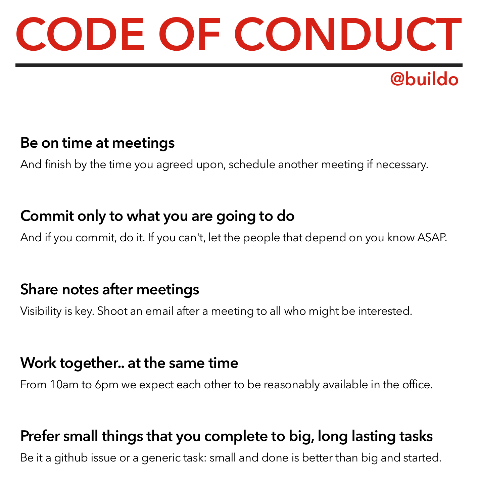

# Code of Conduct (CoC)

We have a very succinct code of conduct.

There were many points discussed, but we picked the top 5 so that we can really commit to them. This is exactly in the spirit of the second point of the CoC itself (recursion is a bitch).

Like everything in buildo, nothing is set in stone. This CoC reflects the values we believe in; if we change our minds as a team we'll adapt it and everyone is more than welcome to propose changes.

In the next subsections we'll give suggestions on how to follow the CoC with the help of tools.

## Be on time at meetings

The definition of "on time" can be subjective. Take it as "exactly on time", and not "5 minutes late is OK", and you'll make everyone happy.

Meetings live in [Google Calendar](https://calendar.google.com/). If you want some people to join a meeting, remember to invite them and check that they accept your invite. Conversely, watch out for invitations and RSVP in a timely manner (typically within a few hours is OK).

For bigger meetings, in particular, prefer "loft 2" as the meeting area. There, you are free to talk aloud and discuss using whiteboards. If you specify the meeting area, people will more likely be there on time.

To remind yourself of a meeting, you can use Google Calendar on your phone, or enable the Slack integration [here](https://buildo.slack.com/services/gcalendar) (for more info on Slack, refer the [corresponding section](http://book.buildo.io/collaboration/1.slack.html)).

## Commit only to what you are going to do

A commitment is created when two people agree that one will do something for the other within a certain time.

A commitment should always be clearly put, and these attributes should be clear:

- Requester: the person who requested the task, and who accepts it when completed.
- Performer: the person who's responsible for the execution of the task, and who notifies the requester when done.
- Task: a clear specification of all that should be done.
- Due date: a date by which the task should be completed.

Consider this a negotiation, not an order. Both performer and requester must agree on the commitment.

Remember to notify the other people involved if things change; especially if the commitment cannot be held.

To keep track of commitments, we don't yet have a standard way. Suggested tools are:

- Slack reminders (which you can set on others, too)
- Emails (you can use RightInbox to set reminders, or Google Tasks to convert emails into tasks with due dates)
- Trello boards (remember to have a due date on the card)

All such tools are good, as long as the commitment is written down and visible to both requester and performer.

## Share notes after meetings

A key aspect of good collaboration is alignment among team members. Alignment of goals, alignment of information. Sharing notes after meetings serves two purposes:

1. Inform people who were not present at the meeting
2. Recap in written format the key outcomes and decisions of the meeting

We manily use [DropBox Paper](https://paper.dropbox.com/) to take and share notes. If the meeting notes contain a task list, *try* to write each action point in the form of a commitment, by clearly specifying the task content, the performer and the due date.

## Work together.. at the same time

We like to work together, it's more fun and more productive. Typically we start between 9am and 10am, and finish up between 6pm and 7pm.

Organize meetings after 10am and before 6pm to make sure everyone attends, and try to avoid lunch time (1:30pm till 2:30pm).

## Prefer small things that you complete to big, long lasting tasks

This is a general principle, and it helps a lot. You will see it in effect in our GitHub issues (we keep them small), our iteration planning, the size of features in development, etc.

A good way to see if you're really doing small things, and keeping the "flow", is to count your WIP (work in progress) taks. We do this in GitHub with the WIP label, but you can do it with everything you are working on. The goal is to keep low WIP and high throughput. This is *flow*.

---

For the curious ones, here's the original document we used to discuss the CoC (the link is not publicly accessible): https://paper.dropbox.com/doc/code-of-conduct-VnfduvHgNmOY0v3xqfnNC
