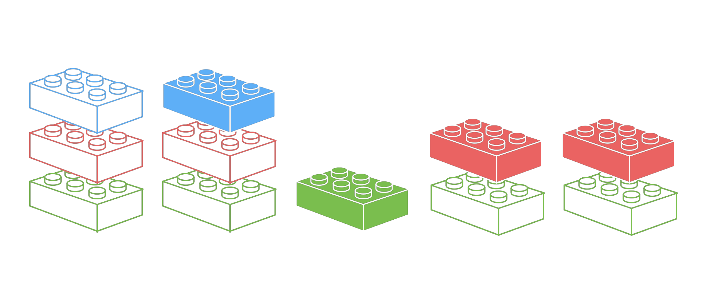
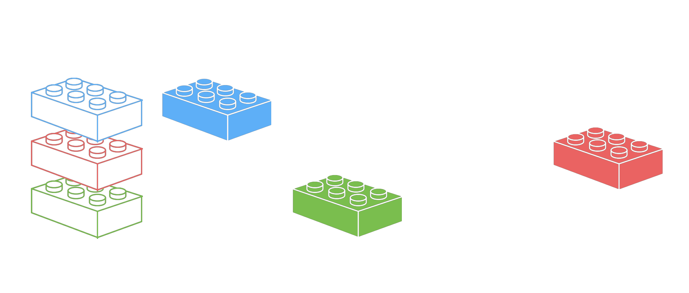
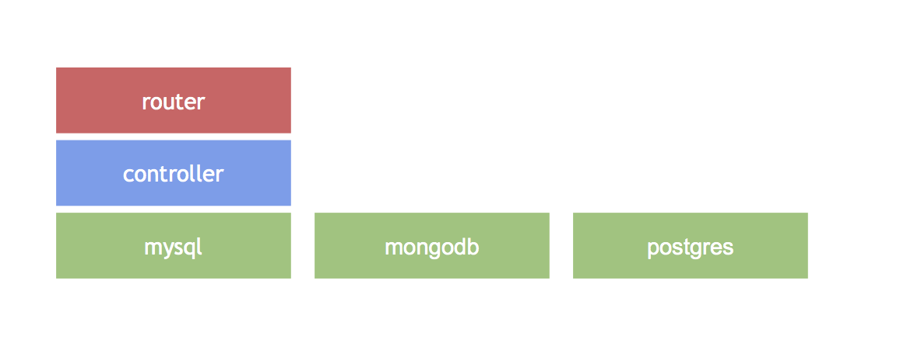

# Back-end development

## Nozzle

*Nozzle* is a set of modules for uniform project bootstrap.
Each module is implemented as a "Scala" trait, and the needed dependencies are injected in the application using a dependency injection framework.
In this way, we obtain an easily extensible and highly modularized architecture.
We intend to apply this approach to lots of different projects, and it allows us to ship robust code in short time.

## Principle of Least Power
Writing this book, we came across [this](https://lihaoyi.github.io/post/StrategicScalaStylePrincipleofLeastPower.html) very good article by Haoyi about what he calls "Principle of Least Power".

In a nutshell, the principle states that:
*Given a choice of solutions, pick the least powerful solution capable of solving your problem*.

The *Scala* language is large and complex, and it provides a variety of tools that a developer can use to do the same thing in a variety of ways.
Picking the last powerful solution makes your code "easier to read" and "less complicated".

We believe that, writing a *Scala* backend, you can benefit from following this principle.

## Why not a Framework?

Frameworks are monolithic beasts that come with lots of features and lots of problems.
Using a framework you have to respect its limitations and work the way it requires. Choosing a framework that fits the needs of all our projects is hard.
Also, we prefer investing our time learning a language, not a framework.

## Mix-Match Architecture

*Nozzle* aims at defining the foundations highly modular and extensible back-end architecture.
In this way, we expect to produce code that is easily testable and reusable.

To do that, we rely on what we call a *mix-match* architecture.
In a few word, we initialize the dependencies during the bootstrap of the application and we inject them in the rest of the code.

For example, suppose our app has three modules: a red module, a blue module and a green module.

Inside the modules, the developer is allowed to use only interfaces (the empty blocks).
If the blue block needs to use some method of the red one, it will use only the empty red block. There is no need for the developer to even know that there is a real, filled red block.
At compile time, the correct dependency is injected and the blue block will call the methods of the concrete red block.

The delegation of the selection of a concrete implementation to an external object is called *inversion of control*.

*Inversion of control* allows to:
- Decouple your modules from their dependencies so that the dependencies can be replaced or updated with minimal effort
- Test your modules in isolation, without using the dependencies
- Decouple your modules from being responsible for locating and managing the lifetime of dependencies

The approach we use, in particular, is called *dependency injection* (or "don't call us we'll call you").

## Conclusions

The result is that we have a set of blocks that we can compose to craft our backends. For instance, we have a module for different kinds of databases. If we change our mind about the best database to use in a project, we can just swap the modules and everything works fine.