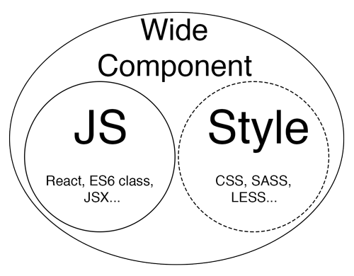

# CSS
 Guidelines to define how to write and organize a component's style.

## Wider definition of "Component"
 Components often need to be styled. In fact we should improve the definition of "Component" to include also its style:



"Style" is dashed as it's optional: a component may or may not have its own style.


A wide component should interact with its parent and children only through props. This is true also for the style which means:

1. A component's style must not be influenced by other components.
2. A component's style must not have side-effects on other components.
3. The style, as every other component's behavior, should reflect the component's current props.

## Where do I put the CSS for my component?
We accept two ways for defining a component's style:
- separate `.scss` file
- inline style defined inside the component itself

To avoid confusion you should **never** use both ways together! (dynamic properties are the only exception)

#### separate SASS file
 Putting the style in a separate `.scss` file is the standard and suggested approach.
It's always ok to do it, even for components with only a few lines of SASS. 

Components with a complex style are **required** to follow this convention.

The CSS rules should be defined in a `.scss` file named as the component in camelCase (`myBeautifulComponent.scss`)


If it is a conceptually standalone component, both the component and its style should be placed in a subfolder named as the component itself:

```
|_ /MyBeautifulComponent
    |_ MyBeautifulComponent.tsx
    |_ myBeautifulComponent.scss
```

Imports can be made more friendly adding also an `index.ts` to export the react component as default from the folder:

```ts
// index.ts

import MyBeautifulComponent from './MyBeautifulComponent.tsx';
export default MyBeautifulComponent;
```

In CSS side effects are extremely common. To avoid these side effects all the CSS of a component **must** be contained in a unique class named as the component in kebab-case. We use [SCSS (aka SASS)](http://sass-lang.com/guide) to do so:

```tsx
import './myBeautifulComponent.scss';

export default class MyBeautifulComponent extends React.Component<{}> {
  render() {
    return (
      <FlexView className='my-beautiful-component'>
        <p>Some big text</p>
        <button>Green</button>
      </>
    );
  }
}
```

```scss
.my-beautiful-component { // wrapping everything with component's main className is needed to avoid side effects
  
  p {
    font-size: 90px;
  }
  
  button {
    color: green;
  }
}
```

#### Inline style
 If a component has **very minimal** style and if its style can be written in TS (not the case of `flex` for example..) then we may use [inline style](https://facebook.github.io/react/tips/inline-styles.html).

```tsx
export default class MyBeautifulComponent extends React.Component<{}> {
  render() {
    return (
      <FlexView>
        <p style={{ fontSize: 90 }}>Some big text</p>
        <button style={{ color: 'green' }}>Green</button>
      </>
    );
  }
}
```

Inline style may be the preferred way to handle dynamic style that change based on `props`:

```tsx
// inline style

export default class MyBeautifulComponent extends React.Component<Props> {
  render() {
    return (
      <FlexView>
        <p style={{ fontSize: this.props.paragraphFontSize }}>Some big text</p>
        <button style={{ color: this.props.buttonColor }}>Green</button>
      </>
    );
  }
}
```

In the "sass" paragraph we said this:
> Putting the style in a separate `.scss` file is the standard and suggested approach.

Why do we prefer to avoid using inline style?

Inline style, as handy as it might be for dynamic style, has a few problems:
 1. It's less performant than CSS
 2. Components with a lot of style would have a "dirty" and difficult to read TSX
 3. You can't use pseudo classes

## Theme folder
The `/theme` folder should contain "global" SASS files and a `variables.scss` with SASS variables used across the project.

```
|_ src
   |_ app
      |_ theme
         |_ main.scss
         |_ typography.scss
         |_ variables.scss
```

#### variables.scss
`variables.scss` is a SASS file where we can store theme variables.

What should be part of variables.scss?

Rule of thumb for now has been "*everything with a name in the design*" (usually on [Zeplin](https://zeplin.io/), where some projects also have a specific `styleguide` with everything that should be put in `variables.scss`, `typography.scss` etc.):
 - Colors
 - Font weights

And also:
 - Theme padding
 - Theme border radius

It's useful to set variables for padding and border-radius to assure we remain consistent across the project with them.

```scss
/* variables.scss */

// COLORS
$aquamarine: #3D8CB9;
$aquaSky: #DAECF6;
$tradeWind: #E9F3F8;
$cerulean: #009BDE;
$lightBlue: #1B7FB9;

// PADDING
$padding-small: 7px;
$padding-medium: 10px;
$padding-large: 15px;

// BORDER-RADIUS
$border-radius: 5px;
$border-radius-small: 2px;

// FONT WEIGHTS
$regular: 400;
$medium: 500;
$bold: 700;
```

#### main.scss
 Any global style related to the main app layout goes here.

```sass
// PREVENT BOUNCE SCROLLING IN OSX

html {
  overflow: hidden;
}

html, body, {
  height: 100%;
}

// FULLSCREEN APP

html, body, #app {
  height: 100%;
  width: 100%;
}

// OTHER

:focus {
  outline: none;
}

.focused > * {
  outline: -webkit-focus-ring-color auto 5px;
  outline-color: $aquamarine;
}

```

#### typography.scss
 If a project has precise CSS rules for text, we should put them inside `typography.scss`:

```scss
/* typography.scss */

@import './variables.scss';

html {
  font-family: 'Calibri', sans-serif;
  font-size: 15px;
  font-weight: $regular;
  color: $black;
  -webkit-font-smoothing: antialiased;
}

h1 {
  font-weight: $regular;
  line-height: 1.5;
}

strong {
  font-weight: $bold;
}

a {
  cursor: pointer;
  color: $aquamarine;
}

```

## Browser CSS reset
 Browsers have different default rules for CSS. To normalize them we use [buildo-normalize-css](https://github.com/buildo/normalize-css).
