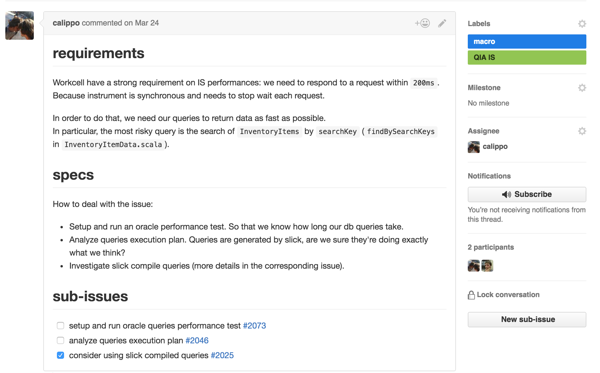
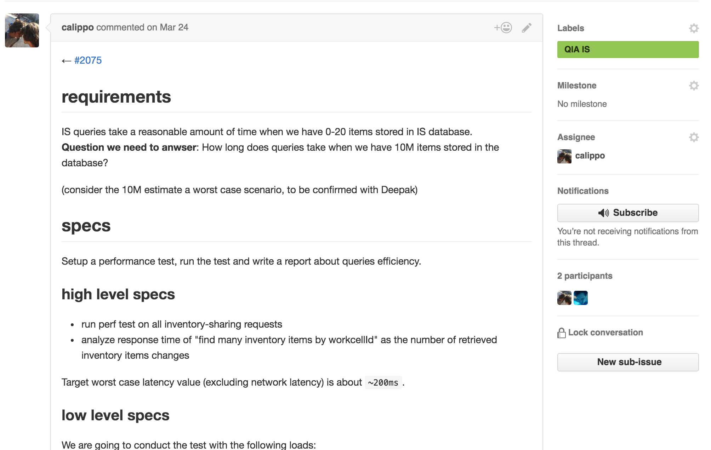

# Issues

Issues can be of different kinds (feature, defect, bug, etc.) and each kind will have specific sections. Every issue contains all the necessary information for understanding the work that has to be done and the the discussion about such work happens in the issue page itself.

We won't get into specific details about issue sections here. Such sections are pre-populated for you with a template when using our [*workflow-pal*](http://book.buildo.io/workflow/6.workflow-pal.html) extension, together with some placeholders to guide you through the process.

Sections and corresponding templates are also subject to changes as they adapt to our workflow; don't expect them to be written in stone. This also means that any constructive feedback is encouraged and welcome.

More on this topic and on workflow pal in future chapters.

## Sub-issues
GitHub doesn't have the concept of sub-issue. Nonetheless, we *really* wanted them, so - guess what - we rolled our own solution.

A sub-issue is useful for breaking down an issue into more small and actionable issues. When this happens, we refer to the original issue as `macro` (and apply the `macro` label to it).

A macro issue has a `sub-issues` section, under which the sub-issues are tracked. Macro issues serve only as aggregation points and they **can't have an associated PR**.

Development happens only on the sub-issues and the macro issue gets closed when all the sub-issues are completed.

Here's an example:

Sub-issues always have a pointer to their macro issue in their body. Here's an example:

> **A word of caution**
> 
> Nothing prevents a sub-issue to be a `macro` issue itself and it may make sense in some instances.
> However, having more than one level of sub-issue depth can quickly become cumbersome to manage.
> 
> As a rule of thumb, limit yourself to one sub-issue level. 

### How we actually do this
As you probably noticed, there's quite a bit of housekeeping required: labels, sections, list of sub-issues, parents backlinks. The idea of doing it by hand is daunting and, as a matter of fact, we don't.

See the `New sub-issue` button in the screenshots above?
That comes from *workflow-pal*, our beloved Chrome extension that we already mentioned above. It works together with *nemobot*, our glorious GitHub bot and flying clownfish, to make our life easier and our workflow smoother.

We'll talk about them in the next chapters.
