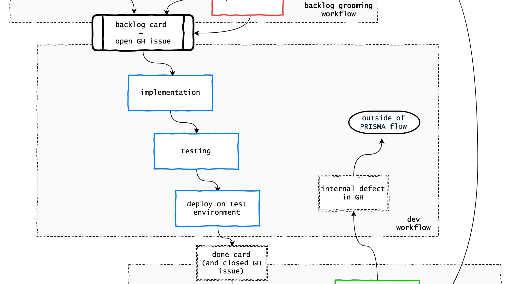

# Dev workflow

The full development workflow is under [Development workflow](../workflow/README.md).

Here we only discuss how issues enter and exit the development workflow, plus the internal defect flow in GitHub.

## From backlog to done

### Choose an issue

Everything starts from an open issue associated to a backlog card. The first thing is to find issues with high priority: those linked to the top cards in the backlog column.

To do this, we have 2 systems:
- **simple flow** PRISMA takes care of labeling the top 5 issues with priority labels, so that devs don't need to leave GitHub.
- **milestone flow** On more complex projects, the milestone flow requires a milestone to be defined with all the issues for the current iteration. Inside a milestone, issues are not prioritized. Developers only take issues from the current milestone.

The milestone flow works if there are sufficient resources on a product, typically for smaller products the simple flow is enough.

To help visualize the current milestone, you can use the [milestone overview tool](https://github.com/buildo/core/issues/201). It's a WIP, still under evaluation :)

### Implement, test and deploy

This is the development flow. Only two things must be highlighed from a PM perspective:
- **testing** is done via test plans: **the first and most important Q.A. step is on developers**.
- **deploy** on the test environment is essential for PMs and customers to test: it's mandatory and should be automated.